# RPS Game Android-CC4

simple rock paper scissors game app using kotlin on android studio

  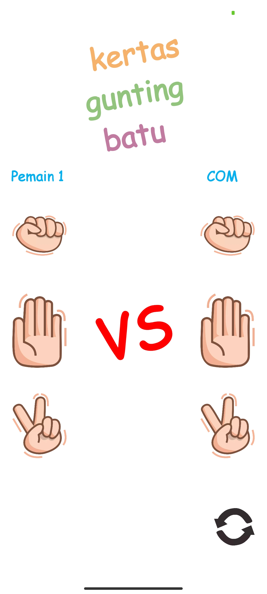
  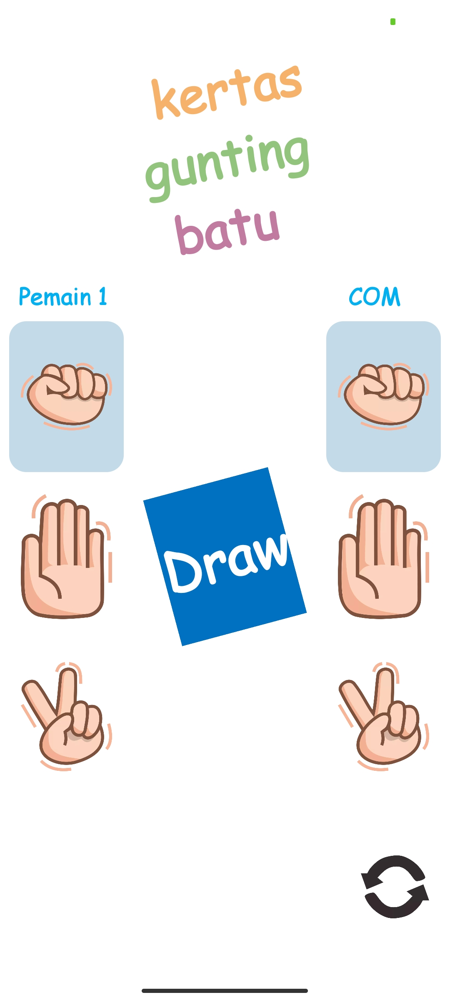
  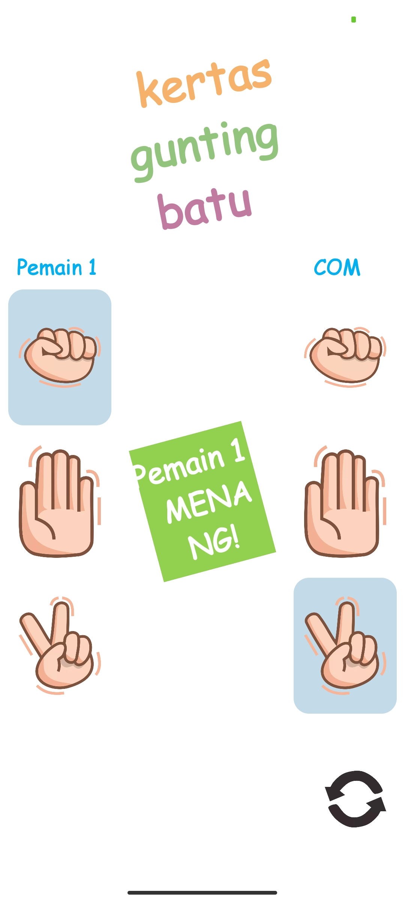

# RPS Game Android-CC5
development of the Android-CC5 RPS Game, this project uses:
- Permissions
- Activity
- Fragment
- Intent & Bundle
- Toast & Snackbar
- Dialog
- View Binding
- View Pager 2
- Glide
- Dots Indicator

  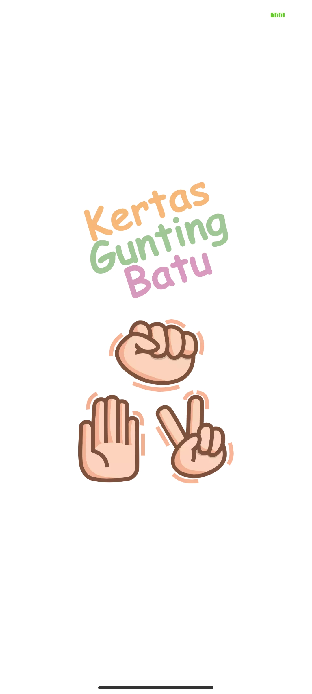
  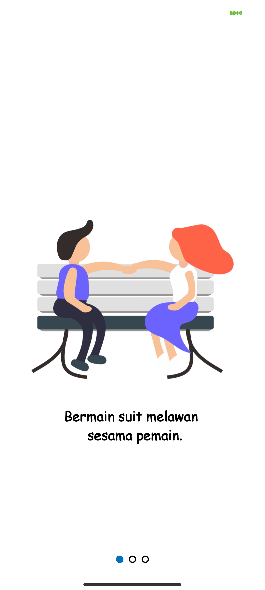
  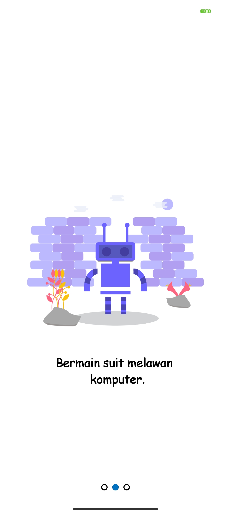
  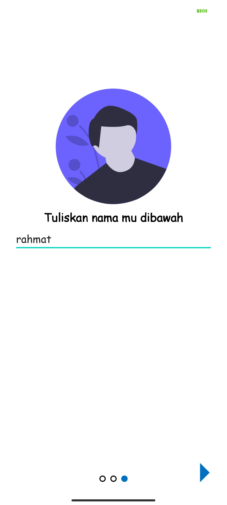
  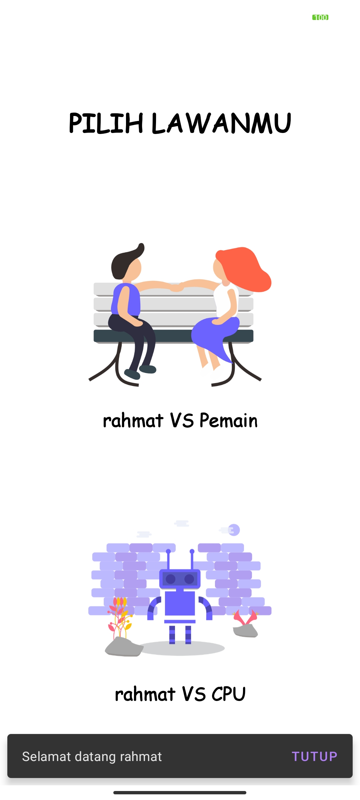
  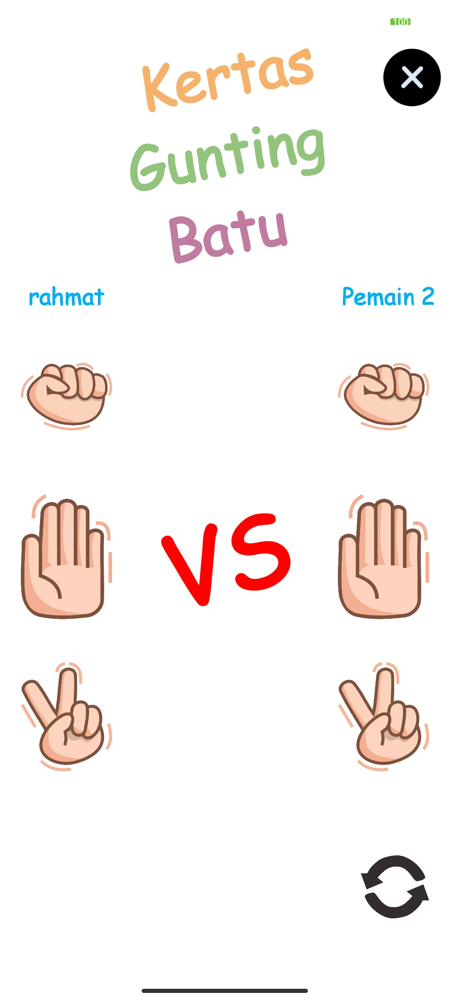
  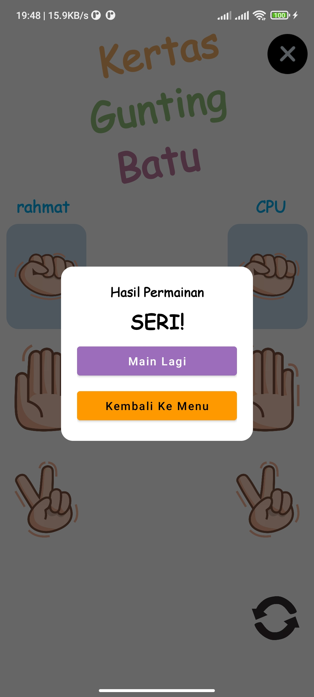
  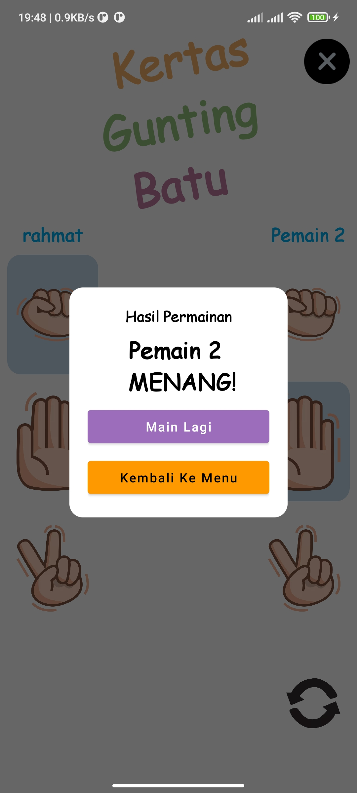

